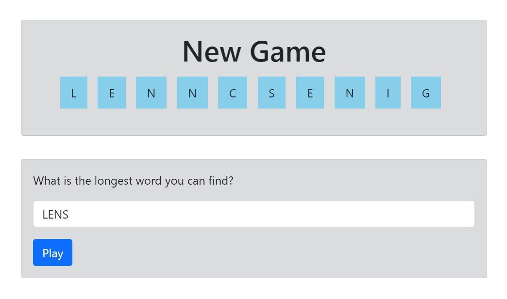

# Longest Word Game

This application gives the player 10 random English letters (may be repeated) and requests the player to provide the longest word possible from these letters.

It then makes a call to an API by Le Wagon (now defunct) to check for the result.

Screenshot of the app

